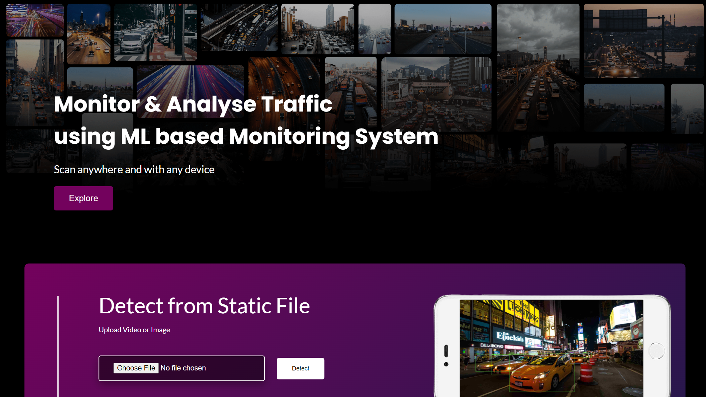

<div align="center">

  <h3 align="center">Traffic Monitoring System</h3>

  <p align="center"><i>
    Based on Machine Learning Model</i>
  </p>
  <br/>

  <p align="center">
    
    
  </p>

</div>

</br>

### Please follow the given steps for installation

* Step:1 - Install virtualenv & activate it.
  ```sh
  pip install virtualenv
  ```

* Step:2 - Install requirements & Flask.
  ```sh
  pip install -r requirements.txt
  ```
   ```sh
  pip install Flask
  ```

* Step:3 - Run Command
  ```sh
  Flask run
  ```